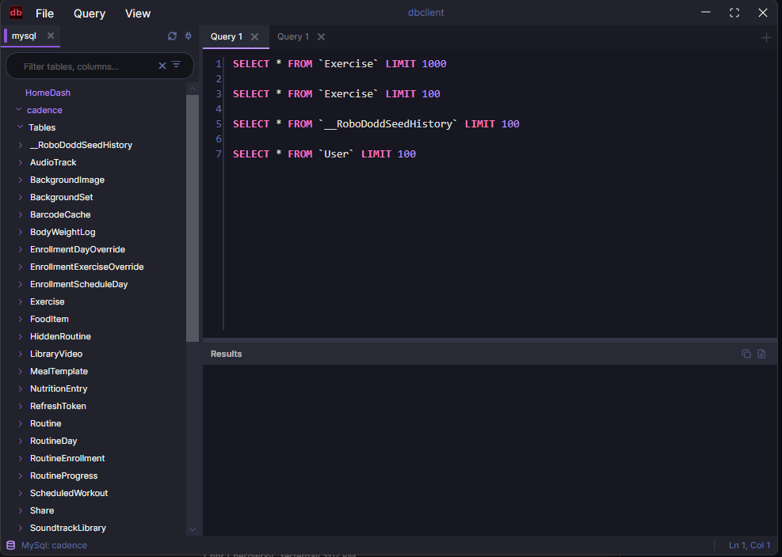

# dbclient

A modern, cross-platform SQL client built with Avalonia UI and .NET 10. Connect to SQL Server (including Azure SQL via `az login`), MySQL, and SQLite — over a direct connection or an SSH tunnel.

> Ported and modernised from the CSVQuery WPF project.



---

## Features

### Connections

- **SQL Server** — TCP, named instances, custom port.
- **Azure SQL** — passwordless sign-in via `DefaultAzureCredential`. Picks up your `az login` session, Visual Studio / VS Code credentials, environment variables, and managed identity automatically. No connection string surgery required.
- **MySQL / MariaDB** — `INFORMATION_SCHEMA`-driven schema introspection.
- **SQLite** — local file database, no server required.
- **SSH tunnelling** — connect through a jump host using a password or private key. Local port is allocated dynamically.
- **Encrypted credentials at rest** — passwords and SSH secrets are AES-encrypted in `~/.dbclient/`.
- **Configurable timeouts** — separate connection and command timeouts per connection.

### Workspace

- **Two-level tabs** — top strip for database connections (color-coded by name hash); inner strip for query tabs, kept as a **separate set per database** — select a database in the schema tree and you get that database's own tabs. Each query tab carries a badge colored by its database name (theme-aware), matching the database's color in the tree.
- **Per-database query tabs** — each database in a connection keeps its own group of query tabs. Switching databases swaps the tab strip; queries written before connecting migrate into the first database automatically.
- **Drag-to-reorder tabs**, inline rename (double-click), close-others / close-to-right / close-to-left from the context menu.
- **Persistent state** — open connections, active database, query text, panel layout, and theme are saved per connection under `~/.dbclient/` and restored on launch.
- **Saved connections sidebar** with edit / delete and a quick-open list.
- **Connection error overlay** with a Retry button when a connection drops or fails to authenticate.

### SQL Editor

- Built on **AvaloniaEdit** with SQL syntax highlighting.
- **Context-aware IntelliSense** — completions narrow to tables in scope, columns of those tables, table aliases, JOIN conditions, and dialect-specific keywords. The parser reads the entire statement, including text after the cursor, so a `SELECT` list can complete from a `FROM` clause that hasn't been written yet.
- **Dialect-specific keywords** — SQL Server (`GETDATE()`, `ISNULL`, `TOP`, `@@ROWCOUNT`), MySQL (`NOW()`, `IFNULL`, `GROUP_CONCAT`, `JSON_EXTRACT`), SQLite (`datetime('now')`, `strftime`, `PRAGMA`).
- **Run selection or full text** — if text is selected, only the selection executes.
- **Format SQL** — built-in formatter (Ctrl+Shift+F).
- **Explain plan** — dialect-aware (`EXPLAIN`, `EXPLAIN QUERY PLAN`, `SET SHOWPLAN_TEXT ON`).
- **Cancel running query** — Esc / Cancel sends a cancellation token to the driver.

### Schema Tree

- Databases, schemas, tables, views, stored procedures, columns (with type, PK and nullability hints).
- **Always-visible filter bar** with `Tables` / `Columns` scope toggles.
  - Filter syntax: spaces are AND, `|` is OR. `customer order|client name` ⇒ `(customer AND order) OR (client AND name)`.
  - Ctrl+Shift+E (or Ctrl+F while the tree has focus) focuses the filter, Esc clears it and returns focus to the tree.
- **Right-click on a table** for `SELECT *`, `SELECT TOP/LIMIT 100`, `SELECT COUNT(*)`, `INSERT INTO`, `UPDATE`, `DELETE FROM`, `CREATE TABLE` / `DROP TABLE` scripts. Quoting is dialect-aware (`[name]` / `` `name` `` / `"name"`).
- **Right-click on a view / stored procedure** for `SELECT *` / `EXEC` / `CALL` templates.
- **Double-click a table or view** to insert `SELECT * FROM …` into the active query tab.
- Ctrl+C copies the selected node's name.

### Results

- **Editable grid** — edit cells inline, then preview and apply a generated `UPDATE` statement back to the database. Primary keys are auto-detected.
- **Multi-result-set support** — `SELECT` queries returning multiple result sets are tabbed.
- **In-grid search** — Ctrl+Shift+R (or Ctrl+F while the grid has focus) filters rows. `NULL` is rendered distinctly from empty strings.
- **Sortable columns** with stable reset.
- **Copy** cell, copy with headers, copy all, **copy as INSERT**, **export to CSV / JSON**.
- **Row limit** (Query → Row limit) with a visible banner when a result is truncated; server messages (`PRINT`, warnings) shown in a Messages pane.
- **Affected-row counts**, error messages with line numbers and SQL Server error codes, execution time in the status bar.

### Query History

- Per-connection history panel (Ctrl+H) with search.
- Recent queries are also surfaced in the **Query → History** menu with a search box.
- Click any entry to load it back into the active editor.

### Themes

Three built-in themes that swap at runtime — **Dark** (default), **Light**, **Dracula**. Cycle from the View menu.

---

## Install / Run

Requires the **.NET 10 SDK**.

```bash
git clone https://github.com/timothydodd/dbclient.git
cd dbclient
dotnet build
dotnet run --project src/dbclient/dbclient.csproj
```

Solution file: `dbclient.slnx`. Build individual projects with:

```bash
dotnet build lib/dbclient.IntelliSense/
dotnet build lib/dbclient.Data/
dotnet build src/dbclient/
```

> On WSL builds against `/mnt/f`, an `MSB3021` file-lock error means an instance of the app is still running. Close it (or build from a Windows terminal) and retry.

Log file: `~/.dbclient/log.txt`.

### Publishing

Self-contained, single-file builds (not trimmed) for each platform are described by the publish profiles in `src/dbclient/Properties/PublishProfiles/`:

```bash
dotnet publish src/dbclient/dbclient.csproj -p:PublishProfile=win-x64     # also: linux-x64, osx-x64, osx-arm64
```

Output lands in `src/dbclient/bin/publish/<rid>/`. On macOS, `assets/macos/make-bundle.sh <publish-dir>` wraps the output in a `dbclient.app`; `assets/dbclient.desktop` is a launcher entry for Linux. Pushing a `v*` tag runs `.github/workflows/release.yml`, which publishes all four RIDs and attaches the archives to a GitHub Release (unsigned).

### Azure SQL setup

For passwordless sign-in:

```bash
az login                       # any Azure CLI auth flow works
az account set --subscription "<your-sub>"
```

Then in the New Connection dialog, pick **SQL Server**, set the server (e.g. `myserver.database.windows.net`), choose **Authentication: Azure (use az login)**, and connect. The token is acquired through `DefaultAzureCredential`, which transparently falls back through environment variables → managed identity → Visual Studio → VS Code → Azure CLI → Azure PowerShell.

---

## Keyboard Shortcuts

| Shortcut | Action |
|---|---|
| Ctrl+N | New query tab |
| Ctrl+W | Close query tab (prompts if unsaved) |
| Ctrl+Tab / Ctrl+Shift+Tab | Next / previous query tab |
| Ctrl+O | Open .sql file |
| Ctrl+S | Save .sql file (Save As when tab has no file) |
| Ctrl+Shift+S | Save .sql file as… |
| F5 / Ctrl+Enter | Execute query (selection or whole editor) |
| Esc | Cancel running query |
| Ctrl+E | Explain query plan |
| Ctrl+Shift+F | Format SQL |
| Ctrl+/ | Toggle line comment (`-- `) |
| Ctrl+F | Find in focused pane (editor / results / schema tree) |
| Ctrl+= / Ctrl+- / Ctrl+0 | Editor zoom in / out / reset |
| Alt+Z | Toggle word wrap |
| Ctrl+Shift+E | Focus schema tree filter |
| Ctrl+Shift+R | Toggle results filter |
| Ctrl+L | Toggle connection panel |
| Ctrl+H | Toggle history panel |
| Ctrl+T | Cycle theme |
| F1 | Keyboard shortcuts |

Workspace state (open tabs, connections, window layout) autosaves a few seconds after each edit, on execute, and on exit; **File → Save Workspace** forces it.

---

## Project Layout

```
dbclient/
├── src/dbclient/              # Avalonia UI app — Views, ViewModels, Services, Themes
├── lib/dbclient.IntelliSense/ # SQL parsing + completion engine (zero deps)
└── lib/dbclient.Data/         # Database connections, SSH tunnelling
```

See [`CLAUDE.md`](./CLAUDE.md) for an in-depth architecture guide.

---

## Tech Stack

- **.NET 10.0**
- **Avalonia UI 12.1** + **AvaloniaEdit 12.0** for the editor and tabs
- **Avalonia.Controls.DataGrid 12.1** for the results grid
- **Dapper** for query execution
- **Microsoft.Data.SqlClient** (with `Active Directory Default` for Azure), **MySqlConnector**, **Microsoft.Data.Sqlite**
- **Azure.Identity** (`DefaultAzureCredential`) for passwordless Azure SQL
- **SSH.NET** for SSH tunnels
- **System.Text.Json** for state serialization

---

## License

MIT — see [LICENSE](LICENSE). Third-party components and their licenses are listed in [THIRD-PARTY-NOTICES.md](THIRD-PARTY-NOTICES.md).

---

## Contributing

Issues and PRs welcome. Run `dotnet build` and `dotnet run --project src/dbclient` before opening a PR; UI changes should be smoke-tested against at least one of SQL Server, MySQL, and SQLite.

